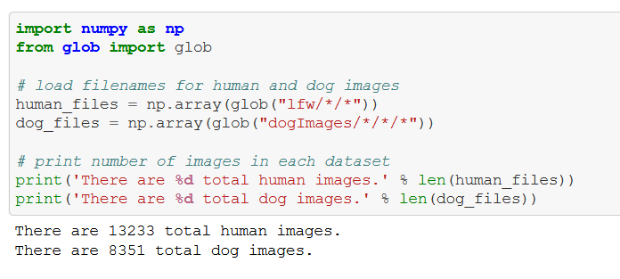
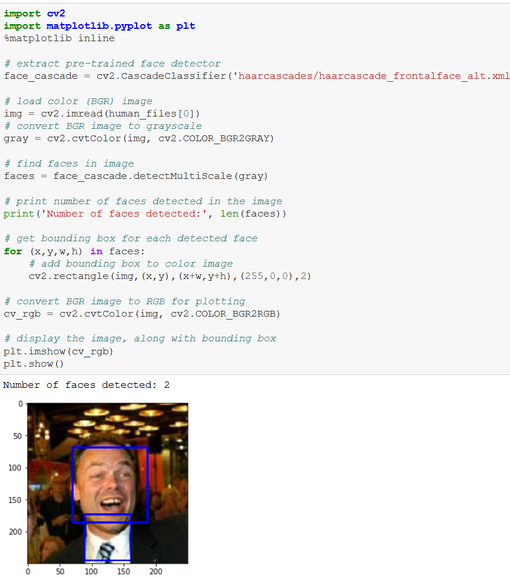
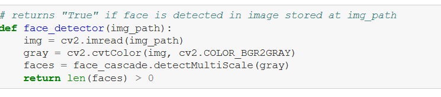
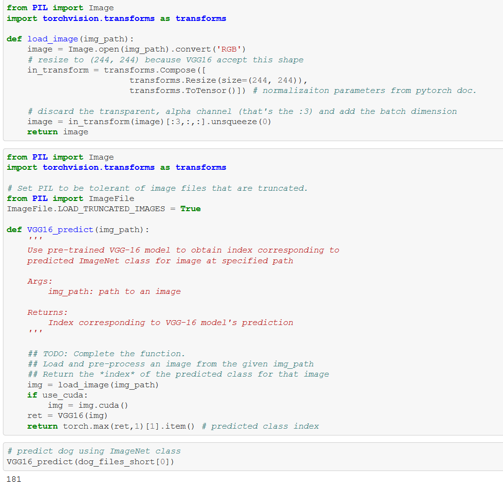
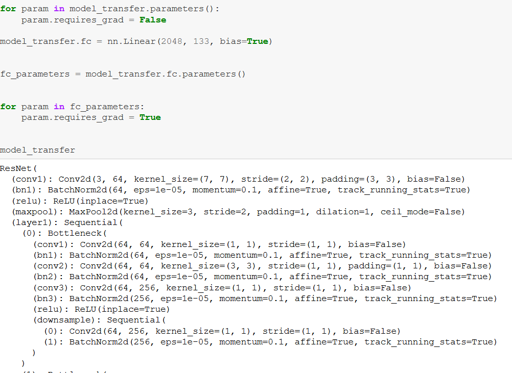
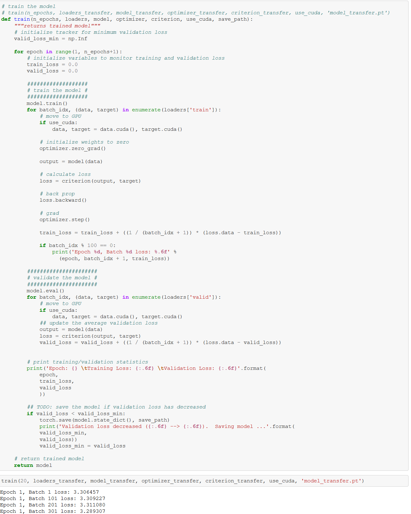
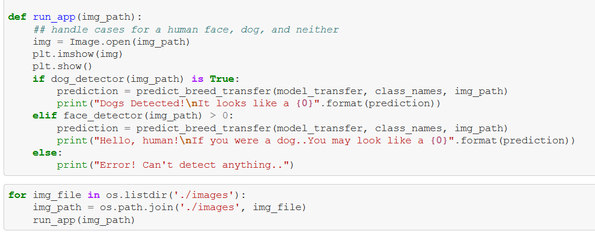
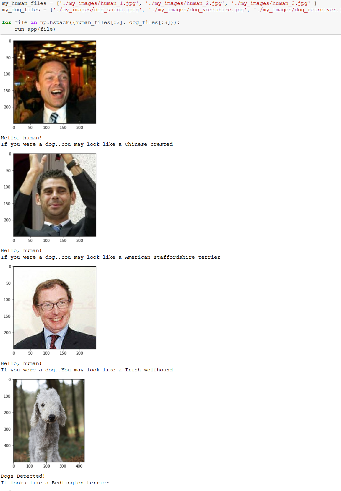

# Dog Breed classifier Udacity Capstone Project

## Project Overview

This project is all about the classic Machine Learning classification. Given a dataset of random images, our model should be able to detect the breed of the dog if a dog is present in the image. We are going to use **CNN (Convolutional Neural Network)** to build this model. 

Initially we are going to import some of the necessary modules required for this project. Then we are going to download the required datasets containing images required for this project. Firstly we are going to try and detect human and dog faces in the datasets before proceeding to the project to get an initial idea. The data is then pre-processed by horizontally flipping, cropping the images and so on and so forth. Python Libraries like TensorFlow and openCV to detect the faces in the images.

We are going to use CNN to classify dog breeds (using Transfer Learning), then write, train and test the algorithm.
## Problem Statement

When a random image is fed into the model, it will classify the image to detect the dog and it's breed in the image and return to the user.

## Importing Modules and datasets

Link to the datasets https://github.com/Gyeah3/dog-breed-classifier-udacity/tree/master/project-dog-classification/images

Pytorch will be the main machine learning (ML) library used for this project. The benchmark model for this project will be the **VGG-16**, a convolutional neural network model proposed by K. Simonyan and A. Zisserman from the University of Oxford, this model achieved 92.7% top-5 test accuracy in ImageNet, which is a dataset of over 14 million images belonging to 1000 classes. Achieving 92.7% accuracy for this project with the small dataset available (8351 images of dogs) in comparison to the image net data set which the VGG-16 was trained is definitely a far reach, but it’s something to aim for. First we are going to import all the necessary modules and libraries required for the project. 

We are going to detect the human faces and dog faces in the image datasets by converting the images into numpy arrays.

We are going to use openCV's implementation to detect the faces in the datasets. openCV provides many pre-trained face detectors and we are going to download one such detector in the harrcascades directory.

Then we write a function which returns **true** on detecting human face.

## Detect Dogs

To detect the dogs, we are going to use a pre-trained model, in this case VGG-16 model. The categories corresponding to dogs in the VGG-16 model appear in an uninterrupted sequence and correspond to index 151–268, inclusive. Thus, in order to check to see if an image is predicted to contain a dog by the pre-trained VGG-16 model, we need only check if the pre-trained model predicts an index between 151 and 268 (inclusive).

Images needs to be pre-processed to tensors before being passed to a neural network, the process_image function below handles this task.

## Creating a CNN to classify the dog breeds

Now that we have functions for detecting humans and dogs in images, we need a way to predict breed from images. In this step, you will create a CNN that classifies dog breeds. We must create our CNN _from scratch_ (so, you can’t use transfer learning _yet_!), and we must attain a test accuracy of at least 1%. 

##  Use a CNN to Classify Dog Breeds (using Transfer Learning)

To reduce training time without sacrificing accuracy, we show you how to train a CNN using transfer learning. In the following step, you will get a chance to use transfer learning to train your own CNN.

Bottleneck features are implemented on pre-trained CNN. I picked ResNet as a transfer model because it performed outstanding on Image Classification. I looked into the structure and functions of ResNet. The core idea of ResNet is introducing a so-called “identity shortcut connection” that skips one or more layers. I guess this prevents overfitting when it's trainin

##Train and test the model

 Since this is a classification problem with no catastrophic consequences for getting a prediction wrong, we will be using accuracy as our evaluation metrics. It is the ratio of number of correct predictions to the total number of input samples. Accuracy an evaluation metric works well for a balanced dataset which happens to be the case for the dataset for this project.
 We train and test the model. DUring the training we run 10 epochs and the save the model with the lowest validation loss for a better accuracy.
 
 
 
## Writing our algorithm

Write an algorithm that accepts a file path to an image and first determines whether the image contains a human, dog, or neither. Then,

    if a dog is detected in the image, return the predicted breed.
    if a human is detected in the image, return the resembling dog breed.
    if neither is detected in the image, provide an output that indicates an error.
    

## Testing the algorithm

Now that we have trained our CNN model and written an algorithm to specify the file path to an image to determine what the image contains, now it's time to test the algorithm and see some interesting results.

## Conclusion and possible improvements

At the start, my objective was to create a CNN with more than 60% testing accuracy under 2 mins of training on GPU. Our final model obtained more than 70% testing accuracy under the training of 20 secs.

There are still very high chances to increase model accuracy with the following techniques:

Image Augmentation, Increasing Dense layers and Increasing no of epochs with Dropout to decrease the chances of model overfitting.

Following the above areas, I’m sure we could increase the testing accuracy of the model to above 95%.

Overall, this project and Udacity's nano-degree has been an eye-opener on how deep machine learning can go and how much more I need to learn. I have absolutely had so much fun doing this project.

 
